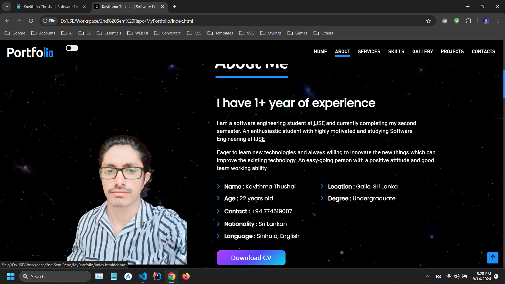
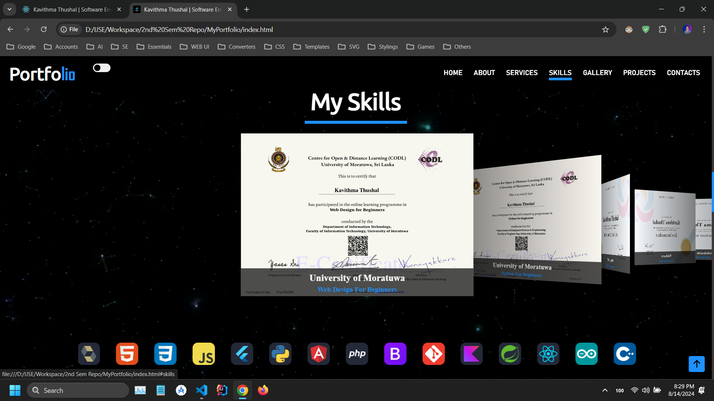
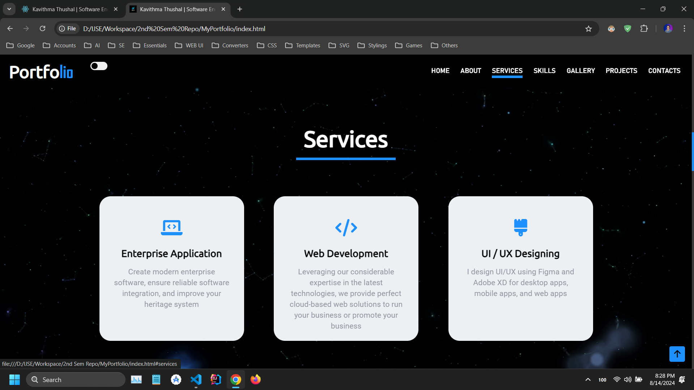
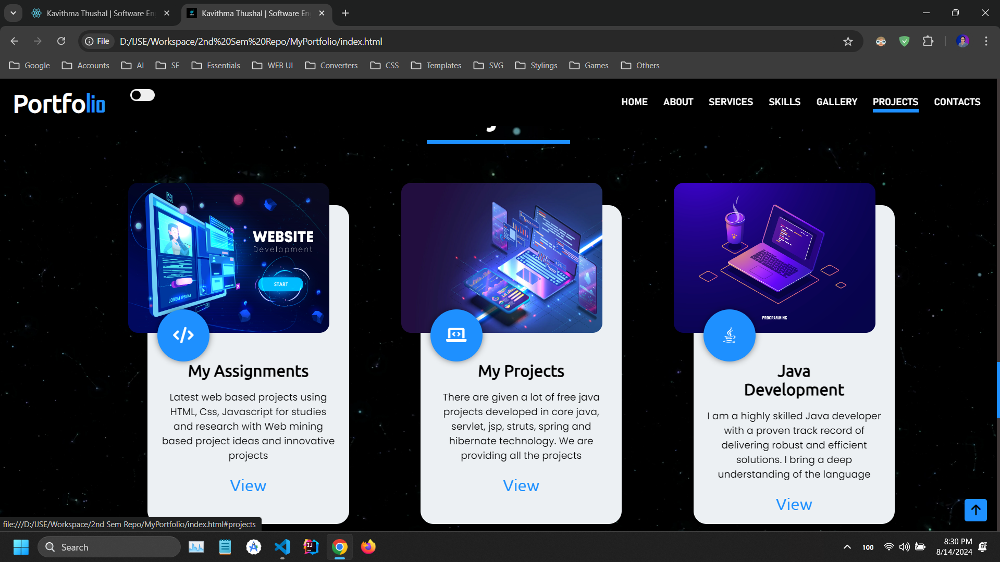
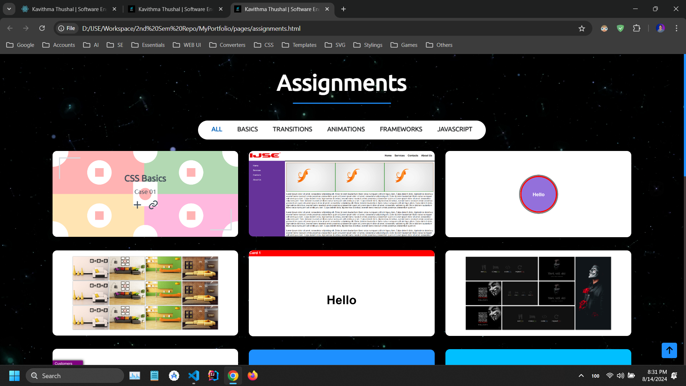
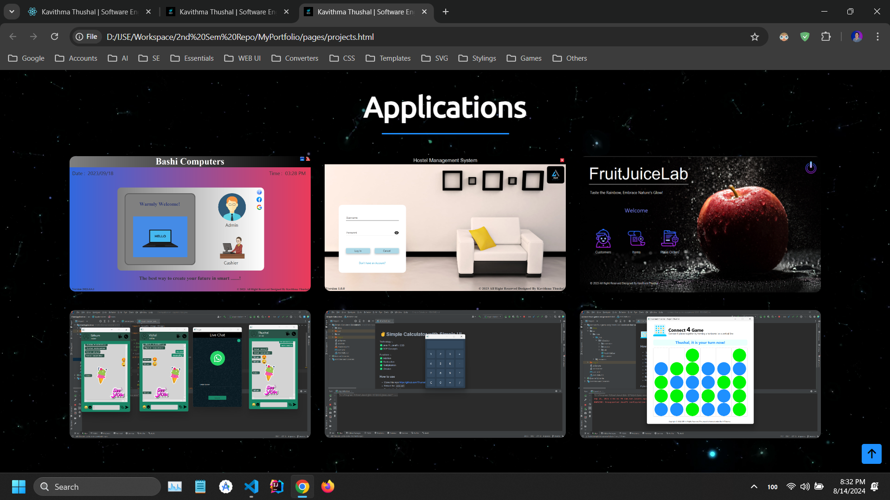
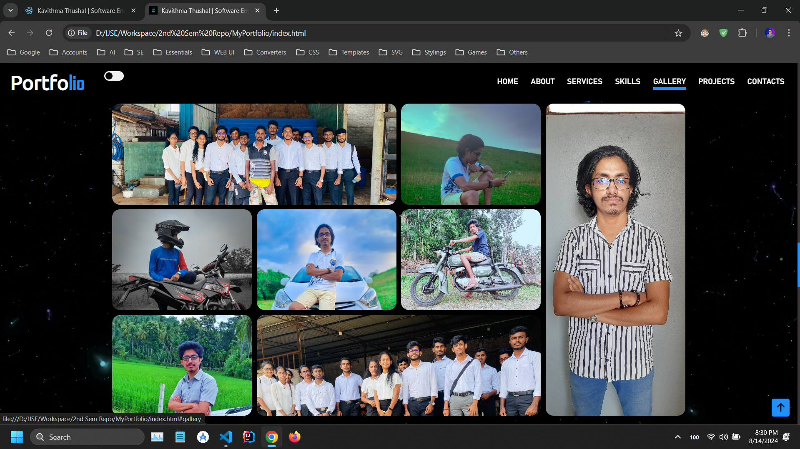
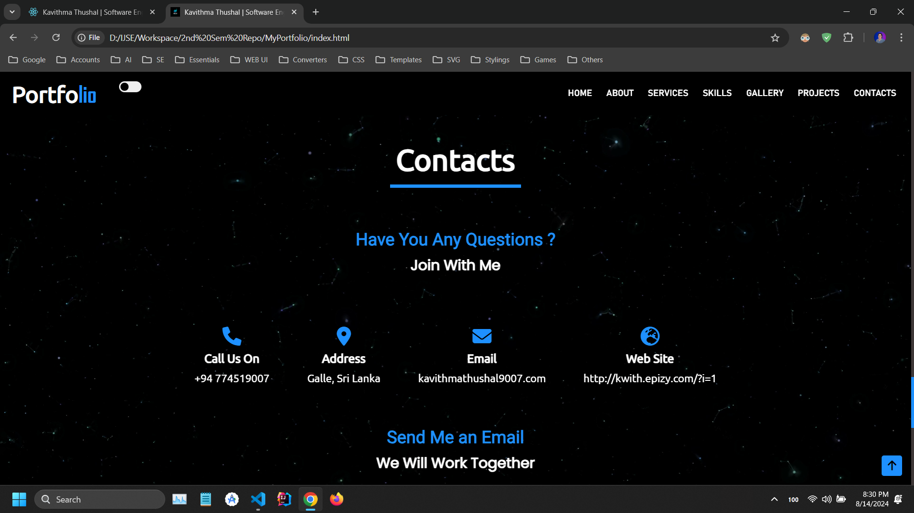
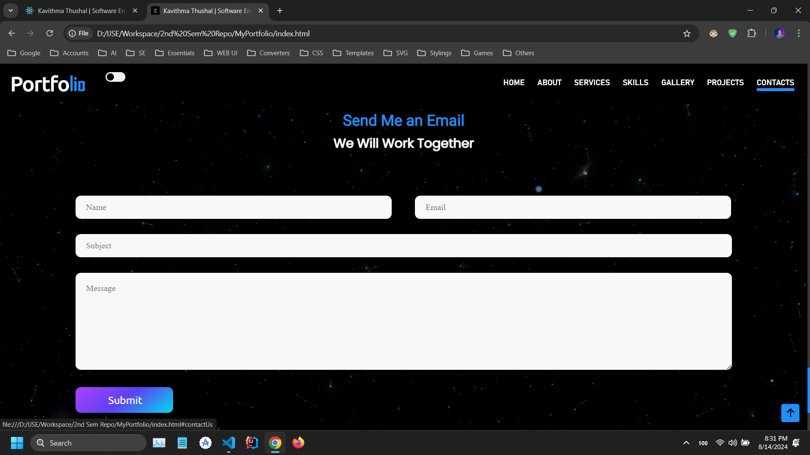
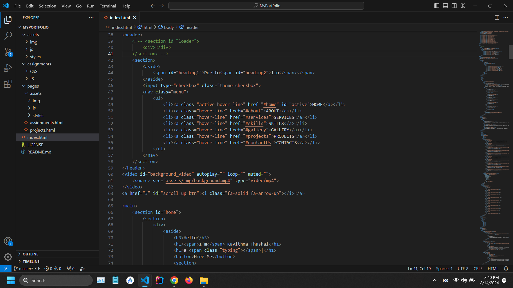

# 🌟 My Portfolio 🌟

My Portfolio is a meticulously crafted representation of my professional journey, skills, and achievements. It showcases
my best work, offering a comprehensive view of my capabilities and growth. It serves as a powerful tool to communicate
my expertise, style, and potential value to prospective opportunities. It's not just a static collection but a dynamic
narrative that evolves with my ongoing progress and new endeavors, demonstrating my dedication, creativity, and unique
perspective in my chosen field. Enter to the world of limitless possibilities and experience the power of code in
action.

## 🛠️ Tools & Technologies
✅ **HTML** 
✅ **CSS** 
✅ **JavaScript** 

## 🔑 Features
✅Discover the full scope of who I am 
✅Delve into a detailed overview of my skills, certifications, and professional journey 
✅Explore my offerings, including the option to download my CV and consider me for hire 
✅Peruse through a showcase of my assignments and successfully completed Java projects 
✅Connect with me across various social platforms through the provided links 
✅This is responsive, so you can browse it seamlessly on any device, from your smartphone to your desktop 

## 🔗 Links

🔗 <a href="https://github.com/Thushal2001/MyPortfolio" target="_blank">GitHub Project</a> 
🔗 <a href="https://thushal2001.github.io/MyPortfolio/" target="_blank">GitHub Page</a> 
🔗 <a href="https://www.gloomaps.com/icbeqVdv9a" target="_blank">Site Map</a> 
🔗 <a href="https://wireframe.cc/29u3zM" target="_blank">Wire Frame</a> 
🔗 <a href="https://www.figma.com/file/mmHVJt25CXdinNz6f48ZB5/My-Mockup?type=design&node-id=0-1&mode=design&t=geCjyFwJrOsqVFJD-0" target="_blank">Mock Up</a>

## 📸 Screenshots

### Home

### About

### Skills

### Services

### Projects

### Assignments

### Applications

### Gallery

### Contact

### Codes

## 📝 Version

Current Version : **1.0.0**

## 📬 Get in Touch

Got any bugs, issues, or need help understanding the code? Feel free to reach out!

📧 [kavithmathushal9007@gmail.com](mailto:kavithmathushal9007@gmail.com)

#### This project is licensed under the [Apache License](LICENSE)

#### © 2024 All Rights Reserved | Designed by [Kavithma Thushal](https://github.com/Kavithma-Thushal)

